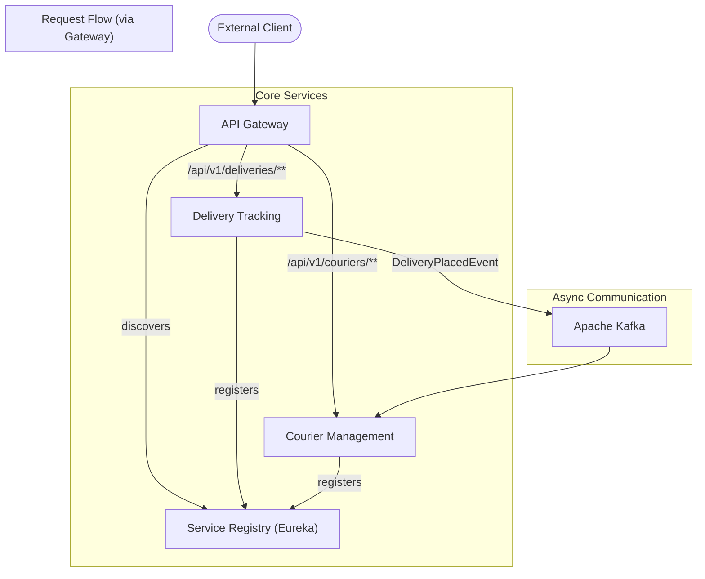

# 🚀 PetrecaDelivery - Plataforma de Microserviços


Bem-vindo ao **PetrecaDelivery**, uma plataforma de entregas desenvolvida com uma arquitetura moderna de microserviços. Este projeto realizado durante as aulas de uma imersão feita pela Algaworks para ser escalável, resiliente e de fácil manutenção, separando as responsabilidades do negócio em serviços independentes e especializados.

## 🏛️ Arquitetura da Plataforma

A plataforma segue os princípios de microserviços, onde cada serviço possui seu próprio domínio e, em muitos casos, seu próprio banco de dados. A comunicação entre eles é facilitada por um **API Gateway** e um **Service Registry**, garantindo um ecossistema desacoplado e robusto.

-   **API Gateway**: Centraliza o acesso externo, aplicando filtros de resiliência como Retries e Circuit Breaker.
-   **Service Registry (Eureka)**: Permite que os serviços se encontrem dinamicamente na rede.
-   **Comunicação Assíncrona (Kafka)**: Eventos de domínio (como "Pedido Realizado") são publicados em tópicos do Kafka, permitindo que outros serviços reajam a eles sem acoplamento direto.
-   **Containerização (Docker)**: Toda a infraestrutura de suporte (bancos de dados, Kafka, etc.) é gerenciada pelo Docker Compose, garantindo um ambiente de desenvolvimento consistente e de fácil configuração.

Abaixo, um diagrama simplificado ilustra a interação entre os componentes:



## 📦 Nossos Microserviços

A plataforma é composta pelos seguintes serviços:

| Serviço | Porta | Descrição |
| :--- | :---: | :--- |
| 📍 **Service Registry** | `8761` | O coração da descoberta de serviços. Todos os outros microserviços se registram aqui para que possam ser encontrados pelo Gateway e por outros serviços. |
| 🚪 **API Gateway** | `9999` | Ponto de entrada único para todas as requisições externas. Roteia o tráfego para o serviço apropriado e aplica padrões de resiliência (Retry, Circuit Breaker) com Resilience4j. |
| 🛵 **Courier Management** | `8082` | Responsável por todo o ciclo de vida dos entregadores: cadastro, consulta, atualização e cálculo de pagamentos. |
| 🚚 **Delivery Tracking** | `8080` | Gerencia a criação e o rastreamento de entregas. Publica eventos importantes (ex: `DeliveryPlacedEvent`) no Kafka para notificar outros sistemas. |

## 🏗️ Infraestrutura de Suporte (via Docker Compose)

A base da nossa plataforma é provisionada pelo `docker-compose.yml`:

-   **PostgreSQL**: Banco de dados relacional para os microserviços.
-   **pgAdmin**: Ferramenta de interface gráfica para gerenciar o PostgreSQL. Acessível em `http://localhost:8083`.
-   **Apache Kafka**: Plataforma de streaming de eventos para comunicação assíncrona.
-   **Kafka UI**: Interface web para visualizar tópicos, mensagens e o estado do cluster Kafka. Acessível em `http://localhost:8084`.

## 🛠️ Tecnologias Utilizadas

A plataforma é construída com um conjunto de tecnologias modernas e robustas:

-   **Backend**: Java 21, Spring Boot 3
-   **Comunicação**: Spring Cloud Gateway, Netflix Eureka, Spring for Apache Kafka
-   **Resiliência**: Spring Cloud Circuit Breaker com Resilience4j
-   **Persistência**: Spring Data JPA, Hibernate
-   **Banco de Dados**: PostgreSQL
-   **Containerização**: Docker & Docker Compose
-   **Build**: Maven

## 📋 Pré-requisitos

Antes de começar, garanta que você tenha as seguintes ferramentas instaladas:
-   JDK 21 ou superior
-   Docker e Docker Compose
-   Apache Maven
-   Uma IDE de sua preferência (IntelliJ, VS Code, Eclipse)

## ⚡ Como Executar o Projeto

Siga os passos abaixo para colocar a plataforma completa no ar em seu ambiente local.

### 1. Iniciar a Infraestrutura
O primeiro passo é subir todos os serviços de infraestrutura definidos no Docker Compose.
Na raiz do projeto, execute:
``` 
docker-compose up -d
```
Este comando irá iniciar o PostgreSQL, pgAdmin, Kafka e Kafka-UI em segundo plano.

Em seguida devemos entrar no pgAdmin e criar dentro do servidor os bancos de dados correspondentes ao descrito no `aplication.yml` dos nossos microserviços **Courier-Management** e **Delivery-Tracking**.
No nosso caso, `courierdb` e `deliverydb` respectivamente.
> **Credenciais do pgAdmin**:
> - **URL**: `http://localhost:8083`
> - **Email**: `dba@petrecadelivery.com`
> - **Senha**: `petrecadelivery`

### 2.Iniciar os Microserviços
É recomendado iniciar os serviços na seguinte ordem. Abra um terminal para cada microserviço.

**A. Service Registry**

Navegue até a pasta /Microservices/Service-Registry
```
cd Microservices/Service-Registry
```
Execute o serviço
```
./mvnw spring-boot:run
```
Aguarde até que o Eureka Server esteja disponível em `http://localhost:8761`.

**B. Outros Microserviços**

Agora, inicie os outros serviços em terminais separados. A ordem entre eles não importa, pois eles se registrarão no Eureka assim que estiverem prontos.

Em um novo terminal, para o Courier Management
```
cd Microservices/Courier-Management
./mvnw spring-boot:run -Dserver.port=8082
```
Definindo a porta explicitamente

Em outro terminal, para o Delivery Tracking
```
cd Microservices/Delivery-Tracking
./mvnw spring-boot:run -Dserver.port=8080 
```
Porta padrão
> **Nota:**  
> Definimos portas diferentes (`-Dserver.port=...`) para evitar conflitos ao rodar localmente fora de contêineres Docker.

**C. API Gateway**

Por último, inicie o Gateway. Ele irá descobrir os serviços já registrados no Eureka.

Em um novo terminal, para o Gateway
```
cd Microservices/Gateway
./mvnw spring-boot:run
```

## 3. Tudo Pronto!

Sua plataforma de microserviços está no ar! Agora você pode fazer requisições para o API Gateway em `http://localhost:9999`, e ele se encarregará de rotear para os serviços corretos.

## 🗺️ Explorando a Plataforma

### Exemplo de Fluxo: Criando uma Nova Entrega
1.  **Rascunho da Entrega (Draft)**: O cliente envia uma requisição `POST` para o Gateway com os detalhes da entrega.
    -   O **Gateway** roteia a chamada para o serviço **Delivery Tracking**.
    -   O serviço de tracking salva a entrega no banco de dados com o status `DRAFT`.

2.  **Publicação da Entrega (Placement)**: Após confirmar os detalhes, o cliente "publica" a entrega.
    -   O serviço **Delivery Tracking** atualiza o status para `WAITING_FOR_COURIER`.
    -   Um evento de domínio `DeliveryPlacedEvent` é publicado no tópico `deliveries.v1.events` do **Kafka**.

3.  **Reação ao Evento**:
    -   O serviço **Courier Management** (ou qualquer outro interessado) consome o evento do Kafka para, por exemplo, notificar entregadores sobre a nova entrega disponível.

### Principais Endpoints da API

Aqui estão alguns exemplos de requisições `curl` para interagir com a API.

**Criar uma nova entrega (rascunho):**
```bash
curl -X POST http://localhost:9999/api/v1/deliveries/ \
-H "Content-Type: application/json" \
-d '{
      "sender": { "zipCode": "12345-000", "street": "Rua do Remetente", "number": "10", "name": "Empresa A", "phone": "11999999999" },
      "recipient": { "zipCode": "54321-000", "street": "Avenida do Destinatário", "number": "20", "name": "Cliente B", "phone": "11888888888" },
      "items": [ { "name": "Produto 1", "quantity": 1 } ]
    }'
```

**Publicar a entrega (para que possa ser retirada):**
```bash
curl -X POST http://localhost:9999/api/v1/deliveries/{deliveryId}/placement
```
Obs: Substitua `{deliveryId}` pelo ID fornecido pelo passo anterior. 

**Listar todas as entregas:**
```bash
curl http://localhost:9999/api/v1/deliveries/
```

### Testando o Circuit Breaker

O Gateway está configurado com Resilience4j para proteger as chamadas aos microserviços. Para ver o Circuit Breaker em ação:

1.  Pare o serviço `Delivery-Tracking`.
2.  Faça várias requisições seguidas para `GET http://localhost:9999/api/v1/deliveries/`.
3.  As primeiras requisições falharão com um erro de `502 BAD_GATEWAY` ou similar (devido às tentativas de `Retry`).
4.  Após 5 chamadas com falha (conforme `minimumNumberOfCalls`), o circuito se abrirá. As próximas requisições falharão imediatamente com um `503 Service Unavailable`, sem nem tentar contatar o serviço.
5.  Observe os logs do **API Gateway** para ver as transições de estado do Circuit Breaker (de `CLOSED` para `OPEN`, e depois `HALF_OPEN`).

### Visualizando Eventos no Kafka

Acesse a **Kafka UI** em `http://localhost:8084` para explorar os tópicos e visualizar as mensagens publicadas pelos serviços.

Após publicar uma entrega (passo 2 do fluxo de exemplo), você poderá ver o evento `DeliveryPlacedEvent` no tópico `deliveries.v1.events`.

## 🙏 Agradecimentos e Considerações Finais

Chegamos ao final da apresentação deste projeto, e eu não poderia deixar de registrar minha imensa gratidão.

Este projeto é o resultado prático dos valiosos ensinamentos adquiridos durante a imersão **"Mergulho Microsserviços Spring"** da **Algaworks**. Agradeço imensamente a toda a equipe da Algaworks pela qualidade excepcional do conteúdo e pelo suporte contínuo.

Em especial, gostaria de agradecer aos mestres [**Alex Augusto**](https://github.com/alexaugustobr) e [**Thiago Faria de Andrade**](https://github.com/thiagofa), cuja didática, paciência e profundo conhecimento técnico foram fundamentais para transformar conceitos complexos em aprendizado sólido e aplicável.

O **PetrecaDelivery** nasceu como um exercício de aprendizado, mas se tornou um portfólio que me enche de orgulho, demonstrando a aplicação de uma arquitetura robusta e alinhada com as melhores práticas do mercado.

Sinta-se à vontade para explorar o código, testar as funcionalidades e, claro, dar seu feedback! Estou totalmente aberto a sugestões, críticas construtivas e futuras colaborações. Se você encontrar algo que pode ser melhorado ou tiver uma ideia para uma nova funcionalidade, não hesite em abrir uma *issue* ou um *pull request*.

Obrigado por dedicar seu tempo para conhecer o projeto!
