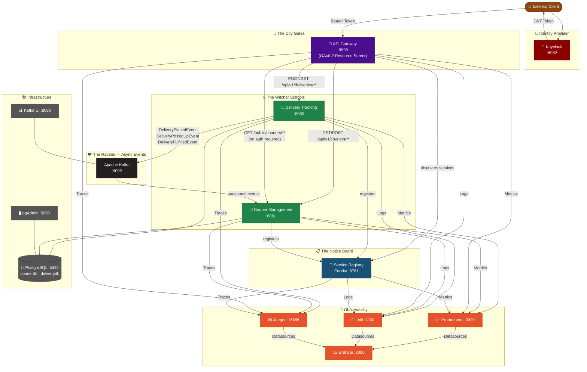

<div align="center">

# ⚔️ PetrecaDelivery

### *"Evil is evil. Lesser, greater, middling — it's all the same. But a witcher must choose."*
### *— And this witcher chose microservices.*

&nbsp;

[](https://openjdk.org/)
[](https://spring.io/projects/spring-boot)
[](https://spring.io/projects/spring-cloud)
[](https://kafka.apache.org/)
[](https://www.postgresql.org/)
[](https://www.docker.com/)
[](https://maven.apache.org/)
[](https://resilience4j.readme.io/)
[](https://prometheus.io/)
[](https://grafana.com/)
[](https://k6.io/)
[](https://www.keycloak.org/)
[](https://oauth.net/2/)
[](https://opentelemetry.io/)
[](https://www.jaegertracing.io/)
[](https://grafana.com/oss/loki/)

&nbsp;

[](https://sonarcloud.io/project/overview?id=weritonpetreca_petrecadelivery)
[](https://sonarcloud.io/project/overview?id=weritonpetreca_petrecadelivery)
[](https://sonarcloud.io/project/overview?id=weritonpetreca_petrecadelivery)
[](https://sonarcloud.io/project/overview?id=weritonpetreca_petrecadelivery)
[](https://sonarcloud.io/project/overview?id=weritonpetreca_petrecadelivery)

</div>

---

## 🎯 Project Objective & Dual Personas

**PetrecaDelivery is a Grandmaster-level portfolio project.** It is not a commercial product, but rather a comprehensive demonstration of advanced backend engineering, DevSecOps pipelines, and cloud-native patterns.

Whether you are a Business Stakeholder looking for ROI, or a Senior Architect inspecting the code, this stronghold was built for you.

### 👔 For the Business Stakeholder (The Alderman's Ledger)
**The Problem:** Traditional, monolithic logistics platforms bleed coin. During peak hours (like Black Friday), the system crashes under load, losing delivery contracts and frustrating couriers. Furthermore, tightly coupled systems mean a bug in courier payouts takes down the entire delivery tracking system, halting operations completely.
**The Solution (How this saves money):**
* **Zero Lost Revenue:** By utilizing Circuit Breakers and Asynchronous Kafka events, if the Courier system goes down for maintenance, Deliveries can still be created and queued safely. No dropped orders.
* **Operational Efficiency:** Automated, precise payout calculations based on distance traveled eliminate overpayment and manual auditing.
* **Rapid Onboarding:** The fully interactive, auto-authenticated API Documentation Portal allows front-end teams and B2B partners to integrate with the platform in minutes, not weeks.

👉 **The Fast Path:** Want to see it working without reading code? Jump down to the [How to Run](#-how-to-run--summoning-the-continent) section to spin up the infrastructure, and you can interact with the entire platform through our centralized, auto-authenticating Swagger UI portal. No Postman or terminal required.

### 🛠️ For the Technical Engineer (The Witcher's Inspection)
By exploring this repository, engineering managers and technical recruiters will find enterprise-grade patterns:
* **Interface Segregation (API Contracts):** REST controllers are stripped of web annotations, implementing pure Java interfaces that act as strict OpenAPI contracts.
* **REST Maturity Level 3 (HATEOAS-lite):** Endpoints strictly adhere to returning `201 Created` with dynamic `Location` headers instead of bloated JSON bodies.
* **Gateway-Aggregated OpenAPI:** A single, central Swagger UI on the Spring Cloud Gateway that dynamically routes and authenticates requests to underlying microservices using Keycloak OAuth2.
* **Event-Driven Architecture:** Decoupled domains communicating asynchronously via Apache Kafka.
* **Full-Stack Observability:** A complete telemetry ecosystem (Prometheus, Grafana, Loki, Jaeger) configured via Infrastructure as Code.

---

## 📜 The Lore

> *In the Continent, monsters lurk in every shadow. In the world of distributed systems, the monsters have different names: cascading failures, tight coupling, single points of failure. Just as Geralt of Rivia wanders the Continent slaying beasts with silver and steel, **PetrecaDelivery** was forged to slay the complexity of modern delivery logistics — with microservices and resilience patterns.*

**PetrecaDelivery** is a production-grade delivery platform built on a microservices architecture. Each service is an independent witcher school — specialized, autonomous, and battle-hardened. They communicate through a **Service Registry** (the Witchers' notice board), an **API Gateway** (the city gates), and **Apache Kafka** (the ravens carrying messages across the Continent).

---

## 🗺️ The Continent — Architecture Overview

> *"The world doesn't need a hero. It needs a professional."* — The architecture agrees.


```mermaid
graph TD
    Client(["🧙 External Client"]):::client --> KC
    
    subgraph "🔐 Identity Provider"
        KC["🔑 Keycloak\n:8082"]:::security
    end
    
    KC -- "JWT Token" --> Client
    Client -- "Bearer Token" --> GW

    subgraph "🏰 The City Gates"
        GW["🚪 API Gateway\n:9999\n(OAuth2 Resource Server)"]:::gateway
    end

    subgraph "📋 The Notice Board"
        SR["📍 Service Registry\nEureka :8761"]:::registry
    end

    GW -- "discovers services" --> SR

    subgraph "⚔️ The Witcher Schools"
        DT["🚚 Delivery Tracking\n:8080"]:::service
        CM["🛵 Courier Management\n:8081"]:::service
    end

    DT -- "registers" --> SR
    CM -- "registers" --> SR

    GW -- "POST/GET /api/v1/deliveries/**" --> DT
    GW -- "GET/POST /api/v1/couriers/**" --> CM
    GW -- "GET /public/couriers/**\n(no auth required)" --> CM

    subgraph "🐦 The Ravens — Async Events"
        K["Apache Kafka\n:9092"]:::kafka
    end

    DT -- "DeliveryPlacedEvent\nDeliveryPickedUpEvent\nDeliveryFulfilledEvent" --> K
    K -- "consumes events" --> CM

    subgraph "🏗️ Infrastructure"
        PG[("🐘 PostgreSQL :5432\ncourierdb | deliverydb")]:::infra
        PGA["🖥️ pgAdmin :5050"]:::infra
        KUI["📊 Kafka UI :8090"]:::infra
    end

    subgraph "🔭 Observability"
        PROM["📈 Prometheus :9090"]:::observability
        LOKI["📝 Loki :3100"]:::observability
        JAEG["🕸️ Jaeger :16686"]:::observability
        GRAF["📉 Grafana :3000"]:::observability
    end

    DT --- PG
    CM --- PG
    PGA --- PG
    KUI --- K

    DT & CM & GW & SR -- "Metrics" --> PROM
    DT & CM & GW & SR -- "Logs" --> LOKI
    DT & CM & GW & SR -- "Traces" --> JAEG
    PROM & LOKI & JAEG -- "Datasources" --> GRAF

    classDef client fill:#8B4513,color:#fff,stroke:#5C2D0A
    classDef security fill:#8B0000,color:#fff,stroke:#5C0000
    classDef gateway fill:#4A0E8F,color:#fff,stroke:#2D0860
    classDef registry fill:#1A5276,color:#fff,stroke:#0E3460
    classDef service fill:#1E8449,color:#fff,stroke:#145A32
    classDef kafka fill:#231F20,color:#fff,stroke:#000
    classDef infra fill:#555,color:#fff,stroke:#333
    classDef observability fill:#E6522C,color:#fff,stroke:#C13C1A
```

---

## ⚖️ Architectural Decisions & Trade-offs

> *"Evil is evil... but architectural choices always come with trade-offs."*

As a Software Engineer, I designed this platform by weighing strict decoupling against system complexity and user experience.

### 1. Hybrid Communication (Sync vs. Async)
**The Choice:** Delivery Tracking publishes state changes to Courier Management asynchronously via Kafka (e.g., `DeliveryPlacedEvent`). However, when calculating a courier's payout before finalizing a delivery, the services communicate synchronously via HTTP.

**The Trade-off:** While making the payout calculation asynchronous (Kafka) would achieve 100% decoupling, it would severely degrade the Developer Experience (DevEx) and Frontend UI. The client would have to implement complex polling or WebSockets just to wait for a simple calculation result.

**The Verdict:** A hybrid approach—Sync for immediate reads/calculations, Async for state mutations—provides the optimal balance of decoupling and client-side simplicity.

### 2. Gateway Registration (Eureka)
**The Choice:** The API Gateway is explicitly registered as a client within the Eureka Service Registry (`register-with-eureka: true`).

**The Trade-off:** While a Gateway technically only needs to *fetch* the registry to route traffic, hiding it from the registry creates an observability blind spot.

**The Verdict:** Registering the Gateway allows Prometheus to dynamically discover and scrape its metrics, providing a unified, complete view of the entire infrastructure in Grafana.

### 3. Embedded Value Objects (Database Design)
**The Choice:** In `deliverydb`, the `ContactPoint` (address) is not an independent table with a foreign key. It is an `@Embeddable` Value Object flattened directly into the `delivery` table.

**The Trade-off:** We sacrifice database normalization (3NF) and the ability to easily query "all deliveries to a specific street independently of the delivery entity."

**The Verdict:** Following Domain-Driven Design (DDD), a contact point has no identity outside of its delivery. Flattening it via `@AttributeOverride` eliminates slow SQL `JOIN` operations, massively optimizing read performance.

### 4. Authentication Flow (grant_type=password)
**The Choice:** The automated end-to-end test script uses the Resource Owner Password Credentials flow (`grant_type=password`) to obtain a JWT from Keycloak.

**The Trade-off:** This flow is deprecated in OAuth 2.1 for production web applications because it exposes raw credentials to the client.

**The Verdict:** For automated, headless shell scripts running in a trusted CI/CD or local test environment, it remains a highly efficient and valid mechanism. A production frontend UI for this platform would strictly use the Authorization Code Flow with PKCE.

---

## 🏰 The Four Schools — Microservices

| School | Port | The Sign It Casts |
| --- | --- | --- |
| 📍 **Service Registry** | `8761` | The **Axii** sign — bends all services to register and be found. The Eureka Server that holds the map of the Continent. |
| 🚪 **API Gateway** | `9999` | The **Quen** shield — the single protective barrier between the outside world and the inner services. Routes traffic and applies **Retry** and **Circuit Breaker** patterns via Resilience4j. |
| 🚚 **Delivery Tracking** | `8080` | The **Igni** flame — ignites the delivery lifecycle. Manages creation, editing, and every checkpoint of a delivery. Publishes domain events to Kafka. |
| 🛵 **Courier Management** | `8081` | The **Aard** blast — assigns couriers to deliveries, manages the full courier lifecycle, and reacts to Kafka events from Delivery Tracking. |

---

## 🔄 The Delivery Lifecycle — A Witcher Contract

```
  [DRAFT] ──place()──► [WAITING_FOR_COURIER] ──pickUp()──► [IN_TRANSIT] ──complete()──► [DELIVERED]
```

| Status | Meaning |
| --- | --- |
| `DRAFT` | The contract is written but not yet posted. |
| `WAITING_FOR_COURIER` | Posted on the board. A `DeliveryPlacedEvent` is fired to Kafka. |
| `IN_TRANSIT` | A courier accepted the contract. A `DeliveryPickedUpEvent` is fired. |
| `DELIVERED` | The contract is fulfilled. A `DeliveryFulfilledEvent` is fired. Courier stats updated. |

---

## ⚡ Resilience Patterns — The Witcher's Armor

The platform is armored with **Resilience4j** at two levels:

**At the Gateway (protecting inbound traffic):**
- **Retry** on `delivery-tracking-route`: 3 attempts with exponential backoff (`10ms → 20ms → 30ms`) on `5xx` errors.
- **Circuit Breaker**: Opens after 50% failure rate over 5 calls. Stays open for **5 seconds**, then enters `HALF_OPEN`.

**At Delivery Tracking (protecting outbound HTTP to Courier Management):**
- **Retry**: 3 attempts on `ResourceAccessException`.
- **Circuit Breaker**: Same sliding window policy, opens for **5 seconds**.

---

## 🔐 Security — The Witcher's Medallion

The platform is secured with **OAuth2 and OpenID Connect** via **Keycloak**.

```
Client → Keycloak (Authentication) → JWT Token → API Gateway (Validation) → Microservices
```

**Keycloak Admin:** http://localhost:8082 | admin / admin  
**Realm:** `petreca-realm` (auto-imported on startup)

**Test User** (created by `create-test-user.sh`):

| Field | Value |
| --- | --- |
| Username | `geralt` |
| Password | `witcher123` |
| Email | `geralt@kaermorhen.com` |

**Public vs Protected Routes:**

| Route Pattern | Auth Required |
| --- | --- |
| `/api/v1/deliveries/**` | ✅ Yes |
| `/api/v1/couriers/**` | ✅ Yes |
| `/public/couriers/**` | ❌ No |

**Security practices implemented:** centralized auth, stateless JWT, 5-min token lifespan, 30-min refresh token, realm isolation, automatic realm import.

---

## 🏗️ Infrastructure — The Continent's Foundations

All infrastructure is provisioned via `docker-compose.yml`.

| Service | Port | Purpose |
| --- | --- | --- |
| 🐘 **PostgreSQL 17** | `5432` | Relational persistence. Hosts `courierdb` and `deliverydb`. |
| 🖥️ **pgAdmin 4** | `5050` | Web UI for PostgreSQL management. |
| 📨 **Apache Kafka** (KRaft) | `9092` | Event streaming backbone. No Zookeeper needed. |
| 📊 **Kafka UI** | `8090` | Web UI to inspect topics, partitions, and messages. |
| 📡 **OTel Collector** | `4317` / `4318` | Receives traces and metrics from all services (gRPC/HTTP) and forwards to Jaeger and Prometheus. |
| 🔍 **Jaeger** | `16686` | Distributed tracing UI. Visualizes end-to-end request traces. |
| 📜 **Loki** | `3100` | Log aggregation engine. Collects and indexes logs from all services. |
| 📈 **Prometheus** | `9090` | Metrics collection and time-series database. |
| 📉 **Grafana** | `3000` | Unified observability dashboard hosting the **Petreca War Room**. |
| 🔐 **Keycloak** | `8082` | Identity and Access Management. OAuth2/OIDC provider. |

---

## 🛠️ The Witcher's Arsenal — Tech Stack

| Layer | Technology                                     |
| --- |------------------------------------------------|
| **Language** | Java 21                                        |
| **Framework** | Spring Boot 3.5.13                             |
| **Service Discovery** | Spring Cloud Netflix Eureka (`2025.0.1`)       |
| **API Gateway** | Spring Cloud Gateway (WebFlux)                 |
| **Security** | OAuth2 + OIDC (Keycloak 24.0)                  |
| **Async Messaging** | Spring for Apache Kafka                        |
| **Resilience** | Resilience4j 2.3 (Circuit Breaker, Retry)      |
| **Distributed Tracing** | OpenTelemetry + Jaeger                         |
| **Log Aggregation** | Grafana Loki                                   |
| **Observability** | Prometheus + Grafana (Spring Boot Actuator)    |
| **Persistence** | Spring Data JPA + Hibernate                    |
| **Database** | PostgreSQL 17                                  |
| **Containerization** | Docker & Docker Compose                        |
| **Build** | Maven (multi-module from root)                 |
| **Code Quality & SAST** | SonarCloud (Quality Gate enforced on every PR) |
| **Dependency Security** | OWASP Dependency-Check (NVD CVE scan)          |
| **Test Coverage** | JaCoCo (reported to SonarCloud)                |
| **Performance Testing** | Grafana K6 (Containerized Siege Engine)      |
| **Utilities** | Lombok, Bean Validation                        |

---

## 🛠️ Getting Started

### 📋 Prerequisites — Before You Draw Your Sword

- ☕ **JDK 21+**
- 🐳 **Docker & Docker Compose**
- 📦 **Apache Maven** (or use the included `./mvnw` wrapper)
- 🖥️ IntelliJ IDEA (recommended)


---


## 🛡️ CI/CD Pipeline — The Witcher's Preparation Ritual

> *"A witcher who doesn't prepare is a witcher who doesn't return."*

Every push and pull request triggers the pipeline. **No code enters `main` without passing the Quality Gate.**

```
Push / Pull Request
       │
       ▼
┌─────────────────────────────────────────────┐
│  1. Checkout & Set up Java 21               │
│  2. Cache Maven dependencies                │
│  3. mvn verify                              │
│     ├── Unit + integration tests            │
│     ├── JaCoCo coverage report              │
│     └── OWASP Dependency-Check (NVD CVEs)   │
│  4. SonarCloud SAST Analysis                │
│     ├── Uploads JaCoCo coverage             │
│     ├── Detects bugs, smells, vulns         │
│     └── Evaluates Quality Gate              │
│  5. ✅ PASSED → PR can merge                │
│     ❌ FAILED → PR is blocked               │
└─────────────────────────────────────────────┘
```

**To enforce the Quality Gate as a required PR check:**

1. **Settings → Branches → Add rule** (branch pattern: `main`)
2. Enable **Require status checks to pass before merging**
3. Add `SonarCloud Code Analysis` as a required check
4. Enable **Require branches to be up to date before merging**
5. **Save changes**

With this active, no pull request can merge if SonarCloud detects a new vulnerability, security hotspot, or coverage regression that breaks the gate.

---

## ⚡ How to Run — Summoning the Continent

> *Follow the order below exactly.*

### Step 0 — Clone the Repository

```bash
git clone https://github.com/weritonpetreca/petrecadelivery.git
cd petrecadelivery
```

### Step 1 — Raise the Infrastructure

```bash
docker-compose up -d
```

Starts PostgreSQL, pgAdmin, Kafka, Kafka UI, Prometheus, Grafana, Loki, Jaeger, OTel Collector, and Keycloak. Wait **20–30 seconds** for all containers — especially Keycloak — to fully initialize and to our test user be automatically created.

| Service | URL | Credentials |
| --- | --- | --- |
| pgAdmin | http://localhost:5050 | admin@admin.com / admin |
| Kafka UI | http://localhost:8090 | — |
| Prometheus | http://localhost:9090 | — |
| Grafana (War Room) | http://localhost:3000 | admin / admin |
| Jaeger | http://localhost:16686 | — |
| Keycloak | http://localhost:8082 | admin / admin |

---

### Step 2 — Build All Modules

**The Witcher's Path (Fast Local Build):** For local development, heavy security scans are locked behind a Maven profile. Your default build is blazing fast.

```bash
./mvnw clean install -DskipTests
````

### 🛡️ The Grandmaster's Audit (Local Security Scan):
If you want to run the full OWASP Dependency-Check locally (exactly as it runs in the CI/CD pipeline) to check for CVEs before pushing, you must activate the security profile and provide your NVD API key (more details given on [Setting Up Keys](#-setting-up-secrets)):

```bash
export NVD_API_KEY="your_api_key_here"
./mvnw clean install -Psecurity-scan
```

---

### Step 3 — Start the Microservices

**A. Service Registry** *(start first)*

```bash
cd Microservices/Service-Registry
./mvnw spring-boot:run
```

Wait for the Eureka dashboard at http://localhost:8761.

**B. Delivery Tracking & Courier Management** *(either order)*

```bash
# Terminal 2
cd Microservices/Delivery-Tracking
./mvnw spring-boot:run

# Terminal 3
cd Microservices/Courier-Management
./mvnw spring-boot:run
```

**C. API Gateway** *(start last)*

```bash
# Terminal 4
cd Microservices/Gateway
./mvnw spring-boot:run
```

---

### ✅ The Continent is Alive

All services are up at `http://localhost:9999`.

**Full startup sequence:**

```
1. docker-compose up -d           ← infrastructure + Keycloak + test user
2. Service-Registry                ← first microservice
3. Delivery-Tracking               ← either order
   Courier-Management              ← either order
4. Gateway                         ← last microservice
```

---


## 🔥 End-to-End Test — A Witcher's Full Contract

### Option 1: Automated Script (Recommended)


```bash
chmod +x test-delivery-flow.sh
./test-delivery-flow.sh
```

The script authenticates, creates a courier, drafts a delivery, places it, assigns the courier, and completes the delivery — firing all three Kafka events along the way.

Expected final output:

```
========================================
⚔️ Contract complete. Toss a coin to your witcher.

📊 View Kafka events at:         http://localhost:8090
🗄️ View database at:             http://localhost:5050
📋 View service registry at:     http://localhost:8761
📉 View War Room dashboard at:   http://localhost:3000
🔍 View distributed traces at:   http://localhost:16686
🔐 View Keycloak admin at:       http://localhost:8082
```

---

### Option 2: Manual Step-by-Step

**Obtain token:**

```bash
TOKEN=$(curl -s -X POST "http://localhost:8082/realms/petreca-realm/protocol/openid-connect/token" \
  -H "Content-Type: application/x-www-form-urlencoded" \
  -d "client_id=petreca-api-client&grant_type=password&username=geralt&password=witcher123" \
  | jq -r '.access_token')
```

**Create courier → copy COURIER_ID (the end of the `Location`):**

```bash
curl -s -D - -X POST http://localhost:9999/api/v1/couriers \
  -H "Authorization: Bearer $TOKEN" -H "Content-Type: application/json" \
  -d '{"name": "Geralt of Rivia", "phone": "11987654321"}'
```

**Create delivery → copy DELIVERY_ID (the end of the `Location`):**

```bash
curl -s -D - -X POST http://localhost:9999/api/v1/deliveries \
  -H "Authorization: Bearer $TOKEN" -H "Content-Type: application/json" \
  -d '{"sender":{"zipCode":"12345-000","street":"Rua A","number":"10","name":"Empresa A","phone":"11999999999"},"recipient":{"zipCode":"54321-000","street":"Av B","number":"20","name":"Cliente B","phone":"11888888888"},"items":[{"name":"Silver Sword","quantity":1}]}'
```

**Place → pick up → complete:**

```bash
curl -X POST http://localhost:9999/api/v1/deliveries/DELIVERY_ID/placement -H "Authorization: Bearer $TOKEN"
curl -X POST http://localhost:9999/api/v1/deliveries/DELIVERY_ID/pickups -H "Authorization: Bearer $TOKEN" -H "Content-Type: application/json" -d '{"courierId":"COURIER_ID"}'
curl -X POST http://localhost:9999/api/v1/deliveries/DELIVERY_ID/completion -H "Authorization: Bearer $TOKEN"
```

---

### Option 3 — Centralized API Documentation

> *"A witcher's signs are useless if he forgets the incantations. An API is useless if it lacks documentation."*

Instead of forcing frontend teams to hunt down endpoints across multiple microservices, **PetrecaDelivery** features an enterprise-grade, centralized documentation portal hosted directly on the **API Gateway**.

**Access the Portal:** `http://localhost:9999/swagger-ui.html`

### 🧩 1. Interface Segregation (Pristine Controllers)
We strictly separate the HTTP/OpenAPI contract from the business logic execution to maintain a clean architecture.
* **The Notice Board (`*Doc.java` Interfaces):** All `@GetMapping`, `@RequestBody`, `@Valid`, and Swagger `@Operation` annotations live strictly in Java Interfaces. These act as the immutable contracts for the web layer.
* **The Execution (`*Controller.java`):** The concrete Spring controllers implement these interfaces. Free of web-layer clutter, they remain terrifyingly clean and focused purely on delegating tasks to the Domain Services.

### 🔐 2. Integrated Identity (Zero-Friction DevEx)
Developers do not need to juggle Postman environments or terminal to generate JWTs. The Swagger UI is deeply integrated with our Keycloak server, after you generate the user with the `./create-test-user.sh`:
* Click **Authorize** in the UI.
* The Gateway auto-injects the required `petreca-api-client` ID.
* Enter the test credentials (`geralt` / `witcher123`).
* Swagger securely negotiates the **OAuth2 Password Flow** with Keycloak, retrieves the JWT, and automatically attaches the `Bearer` token to all subsequent requests.
* **Persistence:** The token is saved in Local Storage. It survives page reloads and remains active even when you swap the dropdown between the Courier and Delivery API definitions.

### 🛡️ 3. Defeating the CORS Monster
A common trap with Gateway-hosted Swagger UIs is Cross-Origin Resource Sharing (CORS) blocks when the UI attempts to call child services directly on their internal ports.
We bypassed this by configuring the child `OpenApiConfig` files to explicitly declare the Gateway (`http://localhost:9999`) as their single `@Server` origin. All UI traffic routes flawlessly through the Gateway, respecting all underlying Resilience4j circuit breakers and retry policies.

### 📍 4. REST Maturity Level 3 (HATEOAS-lite)
This platform adheres to strict Enterprise REST standards to optimize bandwidth and client routing.
When creating a new resource (e.g., `POST /api/v1/deliveries`), the API **does not** return the entire JSON body. Instead, it returns a hyper-efficient `201 Created` status with an exact **`Location` HTTP header** pointing to the newly forged resource URI (e.g., `Location: http://localhost:9999/api/v1/deliveries/12345`).

---

## 🛡️ Testing the Circuit Breaker

1. Stop `Delivery-Tracking`.
2. Fire several `GET http://localhost:9999/api/v1/deliveries` requests.
3. First responses: `502 BAD_GATEWAY` (Retry exhausted).
4. After 5 failures: circuit **opens** → `503 Service Unavailable` instantly.
5. After 5 seconds: circuit enters `HALF_OPEN` and probes recovery.

Watch Gateway logs: `CLOSED → OPEN → HALF_OPEN → CLOSED`.

---

## 🐦 Inspecting Kafka Events

**Kafka UI:** http://localhost:8090 → topic `deliveries.v1.events`

After placing a delivery you'll see `DeliveryPlacedEvent` published by Delivery Tracking and consumed by Courier Management.

---

## 🗄️ Inspecting the Database

**pgAdmin:** http://localhost:5050

**1. Web UI Login Credentials:**
- Email: `admin@admin.com`
- Password: `admin`

**2. Database Connection:**
Once logged in, expand `Servers` -> `PetrecaDelivery`.

*Note: If pgAdmin prompts you for a password to connect to the database, enter `postgres` and check "Save Password". (This happens because Docker sometimes ignores the auto-login `pgpass` file due to host OS file permissions).*

You will then see:
- `deliverydb` → `delivery` (contains embedded ContactPoint columns), `item`
- `courierdb` → `courier`, `assigned_delivery`
- `keycloakdb` → Keycloak internal tables

---

## 🔭 Observability — The Witcher's Heightened Senses

> *"A witcher's senses are heightened beyond those of ordinary men. So too must our platform see what others cannot."*

The platform implements **full-stack observability**: metrics via Prometheus, logs via Loki, and distributed traces via OpenTelemetry + Jaeger — all unified in the **Petreca War Room**.

### 📡 OpenTelemetry — The Medallion That Vibrates Across Services

Every microservice emits **traces** and **metrics** to the OTel Collector, which forwards them to the appropriate backends:

```
Microservice → OTel Collector ──► Jaeger      (traces)
                               └──► Prometheus  (metrics)
```

A single HTTP request entering the Gateway can be traced end-to-end — latency broken down per service, per database query, per Kafka publish.

### 🔍 Jaeger — The Trace Hunter

**Access:** http://localhost:16686

1. Run `./test-delivery-flow.sh` to generate traces.
2. Select a service from the **Service** dropdown → **Find Traces**.
3. Open any trace to see the full span tree.

You'll see: total duration per service, JPA query spans, Kafka producer spans, HTTP client spans, and error spans in red.

### 📜 Loki — The Scroll Keeper

**Access:** Grafana → **Explore** → **Loki** datasource

```logql
{service="delivery-tracking"}
{job="petrecadelivery"} |= "ERROR"
{job="petrecadelivery"} |= "YOUR_DELIVERY_UUID"
{service="courier-management"} |= "kafka"
```

### 📈 Prometheus — The Memory Keeper

**Access:** http://localhost:9090

```promql
rate(http_server_requests_seconds_count[1m])
resilience4j_circuitbreaker_state
(jvm_memory_used_bytes{area="heap"} / jvm_memory_max_bytes{area="heap"}) * 100
```

---

### 📊 Grafana Dashboards — The Command Fortress

> *"War is never black and white. But our dashboards are always green."*

Grafana (`http://localhost:3000`) is pre-provisioned with two critical dashboards to monitor the Continent. No manual imports are required.

**1. The Petreca War Room (Custom Business Metrics)**
This is the custom command center built specifically for this platform. It tracks the health and behavior of the entire distributed system:
- **Platform Health:** Real-time HTTP error rates, Circuit Breaker states (CLOSED / OPEN / HALF_OPEN), and retry counts.
- **Delivery Intelligence:** Deliveries by lifecycle stage, Kafka event throughput, and active courier count.
- **Trace Explorer:** Direct links to Jaeger traces for the most recent requests — one-click root cause investigation.

**2. JVM Micrometer (Standard Dashboard ID: 4701)**
The gold standard for Spring Boot infrastructure monitoring. This dashboard provides microscopic visibility into the Java Virtual Machine for each microservice:
- **Memory:** Heap and Non-Heap utilization.
- **Garbage Collection:** GC pause durations and frequency.
- **Threads & Connections:** Active JVM threads, Tomcat sessions, and HikariCP database connection pool saturation.

**🔍 Bonus — Trace Explorer:** Direct links to Jaeger traces for the most recent requests — one-click root cause investigation for any error spike.

> All panels, datasources (Prometheus, Loki, Jaeger), and the War Room dashboard are **automatically provisioned on startup** — no manual Grafana setup required.

---

## 🧪 Performance Testing (K6 Siege)
> *"A sword is only as good as the steel it's forged from. A microservice is only as good as the load it can bear."*

To prove the resilience of the API Gateway and downstream microservices, the stronghold is stress-tested using **Grafana K6**. We simulate a horde of 100 concurrent Virtual Users (Witchers) authenticating and requesting delivery data simultaneously.

### The Siege Engine (How to Run)
We use an ephemeral Docker container to run the load test, binding it to the host network so it can strike the local Gateway without polluting your machine with K6 installations.

> *(Note: Ensure your Keycloak and microservices are fully running before launching the siege).*

```Bash
docker run --rm -i --network host -v $(pwd):/scripts grafana/k6 run /scripts/load-test.js
```

### The Battle Plan (Inversion of Control)

The `load-test.js` script is an enterprise-grade template utilizing K6's lifecycle hooks:

* `options` **(The Strategy):** Configures a ramp-up/ramp-down test to 100 Virtual Users over 3.5 minutes. It includes strict DevSecOps thresholds: if the `http_req_failed` rate exceeds 1%, the CI/CD pipeline will fail.

* `setup` **(The Potion):** Executes exactly once before the attack, securely authenticating with Keycloak and passing the JWT down to the worker threads.

* `default` **(The Strike):** The infinite loop executed concurrently by the clones, hitting the Gateway and asserting that HTTP 200 is returned quickly.

---

## 🔑 Setting Up Secrets

> *"Knowledge is power. Guard it well — especially in GitHub Secrets."*

This project uses two external services that require API keys: **OWASP Dependency-Check** (CVE scanning) and **SonarCloud** (SAST analysis). Both keys live as **GitHub Actions Secrets** — never hardcoded.

---

### 🛡️ Secret 1 — NVD API Key (OWASP Dependency-Check)

The OWASP Dependency-Check plugin fetches CVEs from NIST's **National Vulnerability Database (NVD)**. Without an API key, requests are heavily rate-limited and builds may time out.

**How to obtain (free, no account required):**

1. Go to **https://nvd.nist.gov/developers/request-an-api-key**
2. Enter your email and submit. No account creation needed.
3. Check your inbox — click the verification link in the first email.
4. A second email will contain your API key. Copy it.

**How to add to GitHub:**

1. Repository → **Settings → Secrets and variables → Actions → New repository secret**
2. Name: `NVD_API_KEY` | Value: your key
3. Click **Add secret**

The CI/CD workflow activates the security profile and passes the key to Maven via `-Psecurity-scan` which uses `-DnvdApiKey=${{ secrets.NVD_API_KEY }}`.

(**Note**: This heavy scan is disabled by default for local development to keep your build times blazing fast).

---

### 📊 Secret 2 — SonarCloud Token (SAST + Coverage)

**SonarCloud** analyzes every push and pull request for bugs, vulnerabilities, code smells, and coverage. **Pull requests that fail the Quality Gate are blocked from merging into `main`.**

**How to set up SonarCloud:**

1. Go to **https://sonarcloud.io** → **Log in with GitHub**
2. Click **+ → Analyze new project** → select `petrecadelivery` → **Set up**
3. Choose **With GitHub Actions** as the analysis method
4. Note your **project key** (typically `weritonpetreca_petrecadelivery`) — confirm it matches `sonar.projectKey` in `pom.xml`

**How to generate your token:**

1. SonarCloud → avatar → **My Account → Security**
2. Under **Generate Tokens**, enter a name (e.g., `petrecadelivery-ci`) and click **Generate**
3. Copy the token immediately — **it will not be shown again**

**How to add to GitHub:**

1. Repository → **Settings → Secrets and variables → Actions → New repository secret**
2. Name: `SONAR_TOKEN` | Value: your token
3. Click **Add secret**

> After completing these steps, the **Quality Gate** and **Coverage** badges at the top of this README will display live data from your next CI run.

### Environment Configuration (The Campfire)
This project uses environment variables to manage sensitive data and infrastructure coordinates.

Before starting any services, you must create your local configuration file. Copy the provided example file to create your own `.env`:

```bash
cp .env.example .env
````

---


## 📚 Further Reading

- [OAuth 2.0 RFC 6749](https://datatracker.ietf.org/doc/html/rfc6749)
- [Keycloak Documentation](https://www.keycloak.org/documentation)
- [Spring Security OAuth2 Resource Server](https://docs.spring.io/spring-security/reference/servlet/oauth2/resource-server/index.html)
- [OpenTelemetry Java Agent](https://opentelemetry.io/docs/zero-code/java/agent/)
- [Jaeger Documentation](https://www.jaegertracing.io/docs/)
- [Grafana Loki Documentation](https://grafana.com/docs/loki/latest/)
- [Prometheus PromQL](https://prometheus.io/docs/prometheus/latest/querying/basics/)
- [Resilience4j Documentation](https://resilience4j.readme.io/docs)
- [SonarCloud Documentation](https://docs.sonarsource.com/sonarqube-cloud/)
- [OWASP Dependency-Check](https://owasp.org/www-project-dependency-check/)
- [NVD API Key Request](https://nvd.nist.gov/developers/request-an-api-key)

---

## 🙏 Acknowledgements

> *"People call it a stigma. I call it a sign of wisdom."*

This platform was born from the **"Mergulho Microsserviços Spring"** immersion by [**Algaworks**](https://www.algaworks.com/). My deepest gratitude to masters [**Alex Augusto**](https://github.com/alexaugustobr) and [**Thiago Faria de Andrade**](https://github.com/thiagofa) — whose knowledge and patience transformed complex concepts into battle-tested skills.

Feel free to explore, test, open issues, or submit pull requests. The notice board is always open.

---

*"Not all those who wander are lost — some are just tracing delivery routes."*

**⚔️ Toss a coin to your witcher ⚔️**